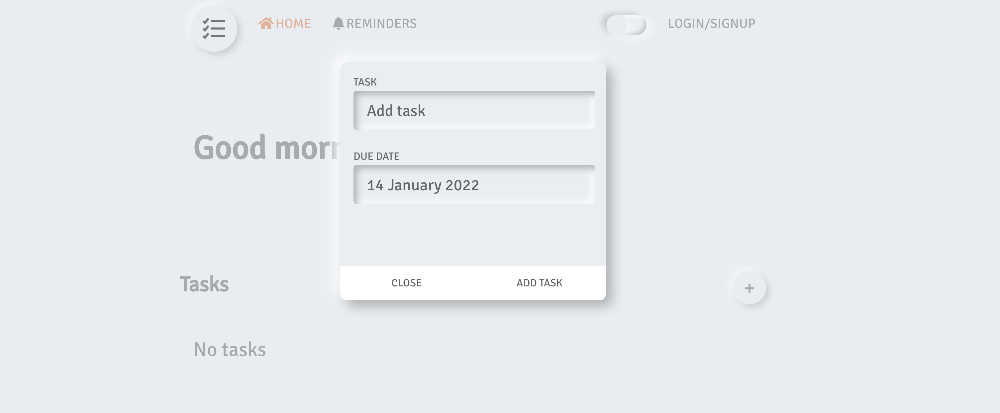

## MongoDB Atlas Hackathon

### Running the project

add the following variables to your env

```bash
export PASSWORD pass
export USERNAME username
export DATABASE db
```

### Clone the repo
```
git clone https://github.com/julekgwa/task-manager.git
```

```
cd task-manager

#run npm install or yarn

```

## Preview



## License
```bash
Licensed under the Apache License, Version 2.0 (the "License");
you may not use this file except in compliance with the License.
You may obtain a copy of the License at

    http://www.apache.org/licenses/LICENSE-2.0

Unless required by applicable law or agreed to in writing, software
distributed under the License is distributed on an "AS IS" BASIS,
WITHOUT WARRANTIES OR CONDITIONS OF ANY KIND, either express or implied.
See the License for the specific language governing permissions and
limitations under the License.